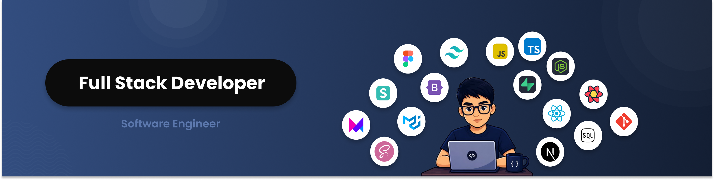

  <h1>¡Hola! Soy Aaron 👋</h1>
  
  <!-- Reemplaza "banner.png" por el nombre de tu archivo local -->
  

---

  <h2>About</h2>

- 🎓 Estudiante de Ingeniería de Software.
- 💻 Full Stack Developer
- 💡 Me encanta resolver problemas y aprender nuevas tecnologías cada día.
- 🌱 Actualmente profundizando en: **[Next.js, Node.js, Testing y Clean Code]**.
- 🥅 Objetivo: Contribuir a proyectos de impacto y seguir creciendo profesionalmente.

---

  <h2>My Skills</h2>

### 🚀 Core Stack

### ⚙️ Technologies to enhance my apps

<!--
**Aaron-Bejar/Aaron-Bejar** is a ✨ _special_ ✨ repository because its `README.md` (this file) appears on your GitHub profile.

Here are some ideas to get you started:

- 🔭 I’m currently working on ...
- 🌱 I’m currently learning ...
- 👯 I’m looking to collaborate on ...
- 🤔 I’m looking for help with ...
- 💬 Ask me about ...
- 📫 How to reach me: ...
- 😄 Pronouns: ...
- ⚡ Fun fact: ...
-->
